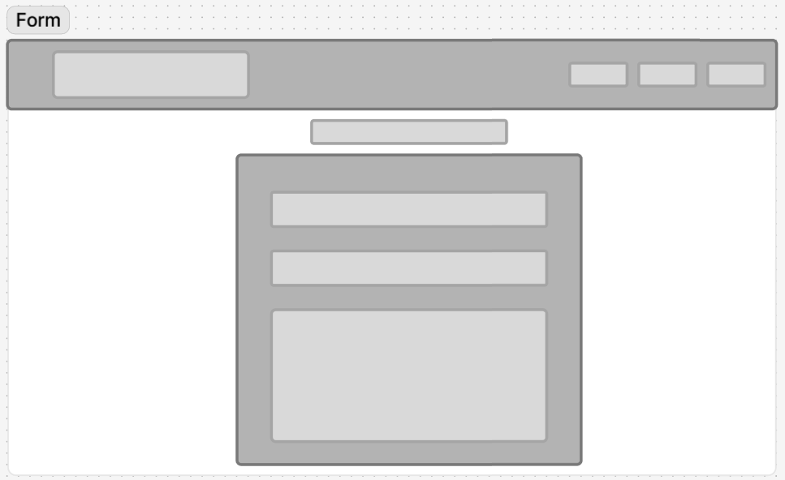
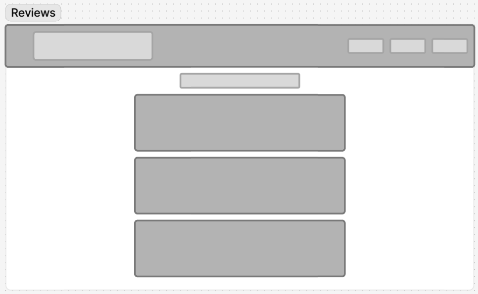
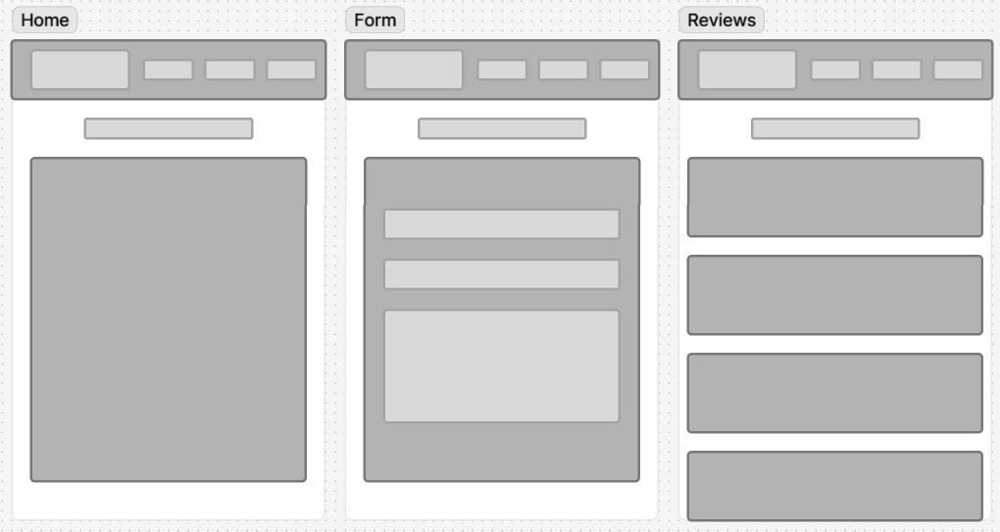
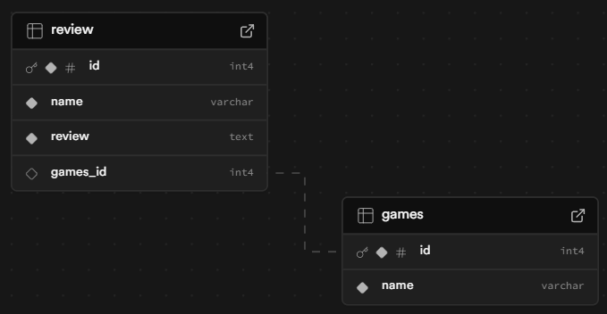

# Reflection

This week's assignment is all about creating and maintaining apps that submit and retrieve info from a database. This is a fundamental part of web development. So many of the apps and websites we use daily, like Facebook, Instagram, and banking app, are essentially database-driven. It's really made me see how crucial databases are to the tech world.

I've found this assignment quite fun, as it closely followed the structure of the full-stack applications we built in weeks 4 and 5, but with the key difference of utilizing React. As usual, we were provided with a clear set of goals to meet, but also had complete creative freedom over the application's concept and design. I decided to build a game review platform, aiming to create a space where users can view community opinions and reviews on titles they are considering to buy.

After two weeks of working with React, I'm gaining a better understanding of it. The way components communicate with each other, passing props to share data and state. I've also begun to appreciate the efficiency of component reusability, which speeds up development and helps maintain a consistent look and feel across the application. Although I still have much to learn, the fundamental ideas of how React structures a UI are starting to stick with me.

If there is anything you think I could do better or improve on, I'd be happy to listen and learn from what you have to say.

# Requirements

- ✅ 🎯 Create a client using React.
- ✅ 🎯 Create multiple pages using React Router.
- ✅ 🎯 Use Express to create your server, using both GET and POST endpoints.
- ✅ 🎯 Use SQL to retrieve posts from the database in your Express server.
- ✅ 🎯 Build a React form for users to create posts.
- ✅ 🎯 Design a database schema, and seed the database with some realistic data.
- ✅ 🎯 Display all posts using .map().
- ✅ 🎯 Use an interval and useEffect() to poll your database.

# Stretch Requirements

- ✅ 🏹 Allow users to delete posts.

# requirements that I wasn't able to achieve

- ❌ 🏹 Create dynamic pages using react-router-dom.
- ❌ 🏹 Use react-router-dom to create a dedicated route for the categories
  - For example, /posts/:categoryName.
- ❌ 🏹 Add ‘like’ functionality on posts.
- ❌ 🏹 Create additional SQL queries to show filtered posts.

# Wireframe

After going through the design methodologies workshop in class with Manny, it really helped me make up my mind on what sort of style I wanted to go for. This week, I took a lot of inspiration from [Material Design](https://m3.material.io/). I spent some time going through their site and their [GitHub repo](https://github.com/material-components/material-web), which helped me design my wireframe.

I feel like I have kept to the wireframe pretty well. Nothing has really changed from my original design. I've left the footer out of the wireframe as when I was doing it I was unsure if I wanted to add one, but thinking about it, I would like to now to see if I can overcome the issues I was having last assignment.

This was the first time having to do a database schema. I ended up using Supabase as it's already pretty much done for you. In the future, I would like to try and use [DrawSQL](https://drawsql.app/)

# Errors or Bugs I Encountered

- When I originally filled out my form, I only added the POST endpoint for my table, so those responses were being saved, but the game ID was being saved as NULL. I need to fetch the game's ID as well.

# What went really well and what could have gone better?

...

# External sources

### Info

[My own repo](https://github.com/IndieMasco/TechEdSoftwareDeveloper021) , [Tech Ed repo](https://github.com/Tech-Educators/software-dev-021) , [FigJam](https://www.figma.com/board/JjN2Zgtoynrau06MjWJs6q/SD021?node-id=0-1&p=f&t=V1WCGcrmVKnoxJDr-0) , [MDN](https://developer.mozilla.org/en-US/) , [W3School](https://www.w3schools.com/) , [Template](https://github.com/Tech-Educators/software-dev-021/blob/main/demos/week6/week6-assignment/src/App.jsx)

### Styling

[material web repo](https://github.com/material-components/material-web) , [Material Design](https://m3.material.io/)

### Env variables and modes

[Env Variables and Modes](https://vite.dev/guide/env-and-mode)
